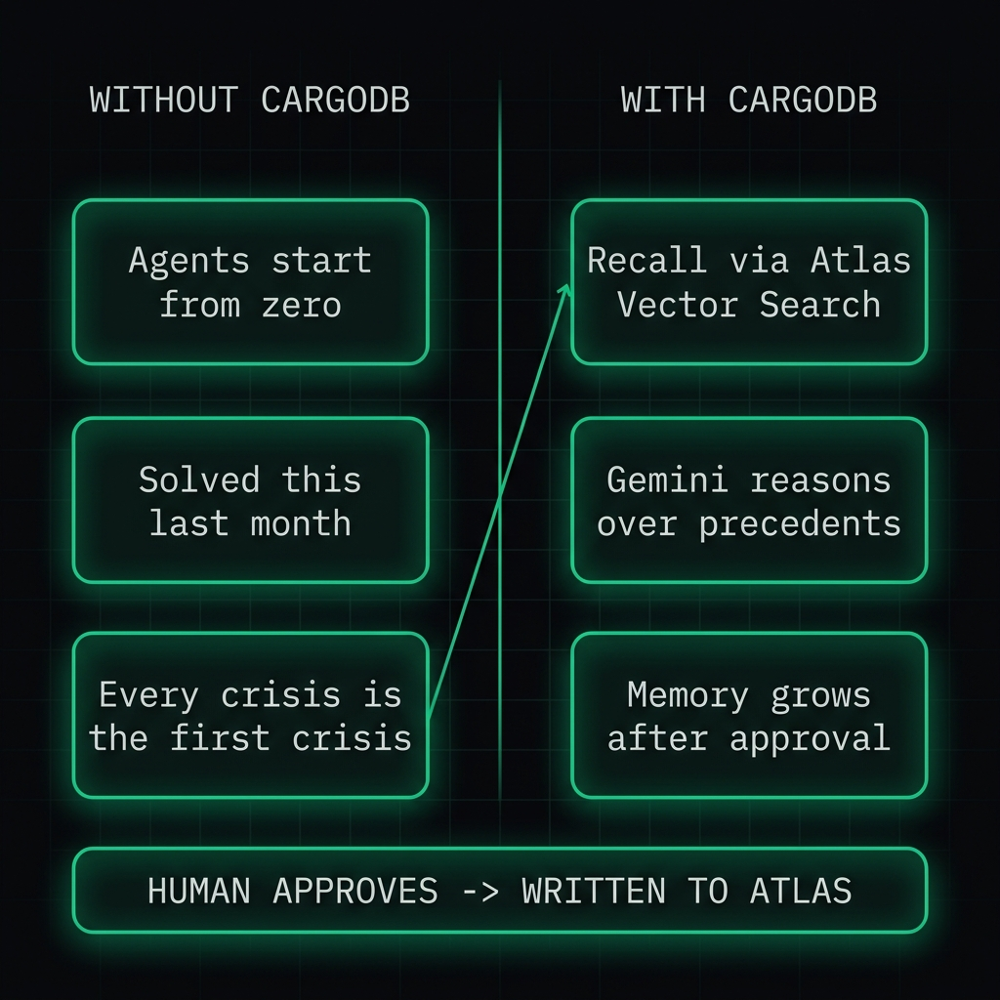
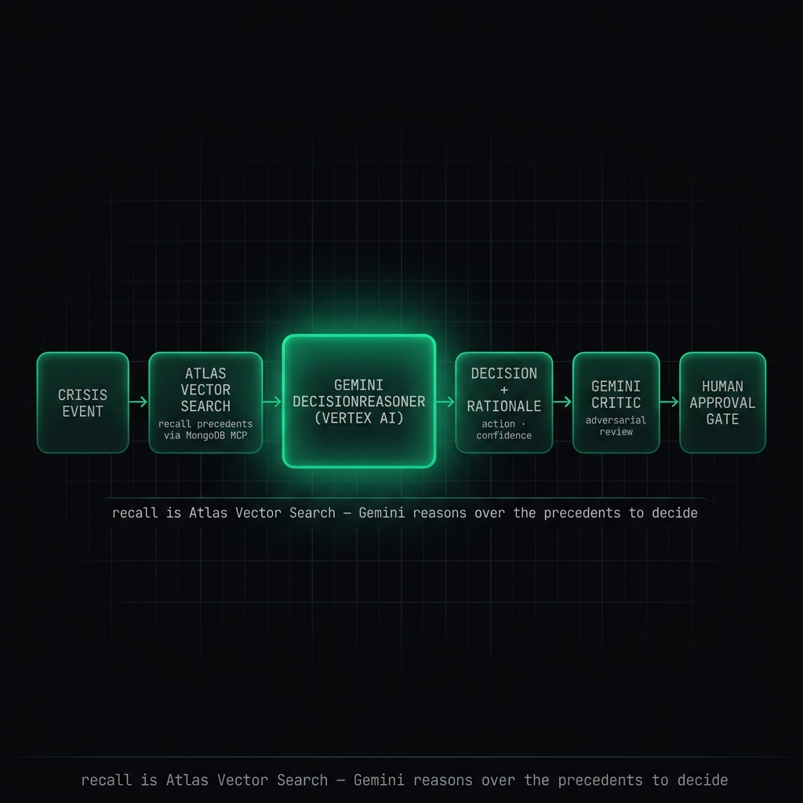
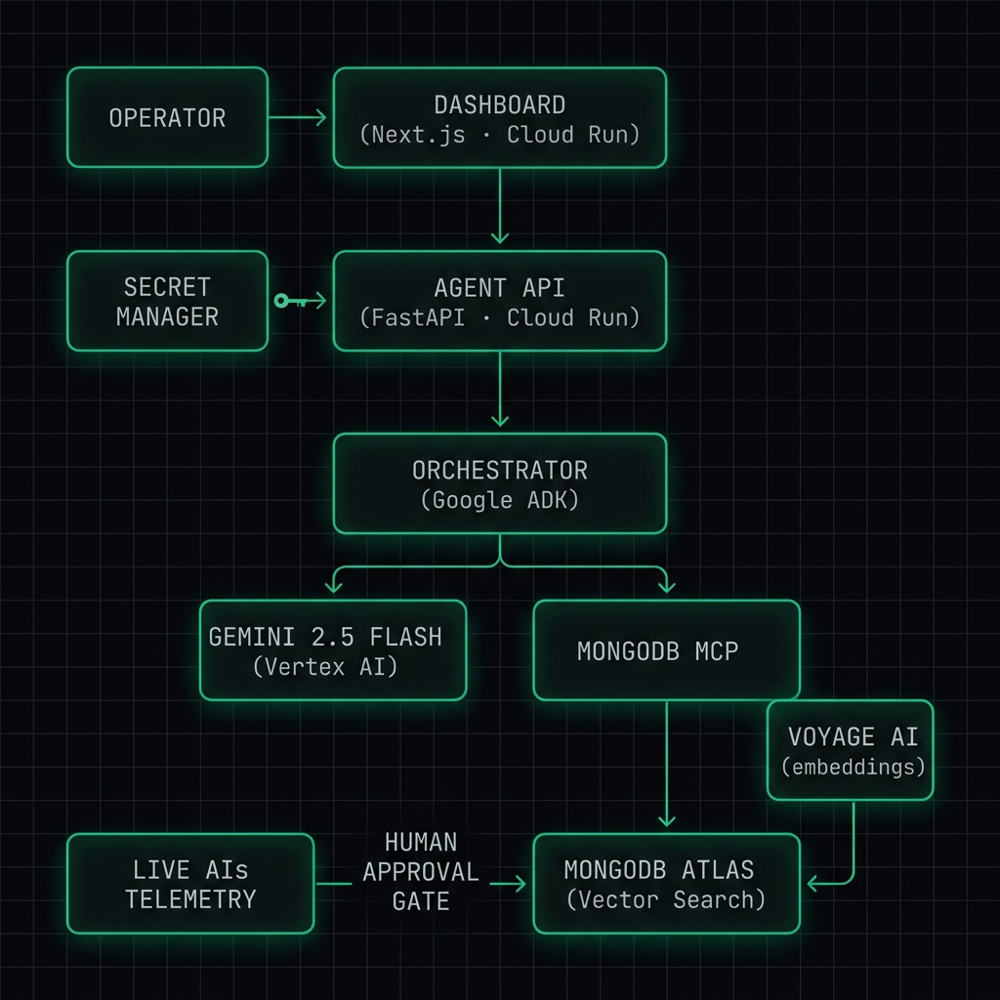
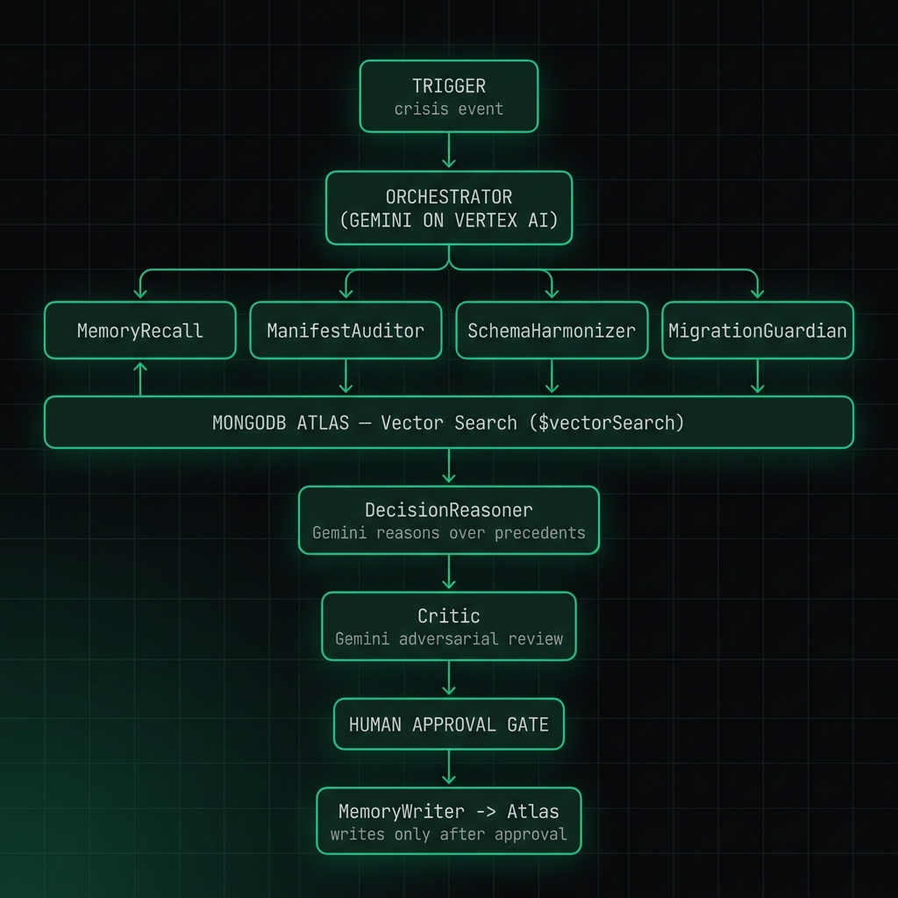

# CargoDB

**Persistent semantic memory for AI agents.** Your agents make hundreds of
decisions, then forget every one of them. CargoDB gives them a memory that can
answer the only question that matters when the next hard call comes in: *"Have
we seen this before — and what did we do?"*

CargoDB stores every decision an agent makes as a vector in MongoDB Atlas, and
recalls the most semantically similar past decisions with Atlas `$vectorSearch`.
A Gemini reasoner then weighs those precedents to recommend the next action —
with an explicit rationale and a human approval gate before anything is written
back.

---

## The problem

AI agents are stateless. Each run starts from zero. The agent that handled a
near-identical situation yesterday has no recollection of it today, so it
re-derives (or re-mistakes) the same call from scratch. There is no
institutional memory, no "we tried that and it backfired," no precedent.

Keyword search does not fix this — two decisions can be the *same* decision in
different words ("hold the shipment" vs. "delay departure pending review"), and
an exact-match index will never connect them. What agents need is **semantic
recall over their own decision history**: retrieval by meaning, not by string.

That is CargoDB. It is the shared memory layer the rest of an agent fleet reads
from — every decision, trace, and outcome captured once and recalled by
similarity whenever it is relevant again.



---

## How it works

```
Event  ──▶  MemoryRecall          Atlas $vectorSearch finds the most
                                   semantically similar past decisions
                                   (Voyage AI embeddings · 1024-dim · cosine)
            │
            ▼
       DecisionReasoner            Gemini (Vertex AI) reasons over the recalled
        (the brain)               precedents → recommended action + rationale
            │                      + visible chain-of-thought
            ▼
          Critic                   Gemini adversarially challenges the decision,
                                   detects prompt-injection in recalled content,
                                   and sets the human approval gate
            │
            ▼
     Human approval ──▶ MemoryWriter writes the decision back to Atlas
                        (only after a human approves — never before)
```

Two distinct capabilities, kept deliberately separate:

- **Recall is pure Atlas Vector Search.** The query is embedded with Voyage AI
  (`voyage-3.5-lite`, 1024 dimensions), and `$vectorSearch` against the
  `decisions_vector_idx` index (cosine similarity) returns the top‑k nearest
  past decisions with a similarity score. No LLM is involved in retrieval.
- **Reasoning is Gemini.** A `DecisionReasoner` specialist takes the recalled
  precedents and chooses the action, citing which precedent drove it and why.
  A `Critic` then challenges that conclusion. If Gemini is unavailable, the
  pipeline falls back to deterministic top-match selection, so it never breaks.

Every decision carries a confidence score, a rationale, and the reasoner's
chain-of-thought (captured and surfaced in the response and dashboard — not
auto-executed). Nothing is persisted until a human approves.



---

## Demo — maritime logistics

> CargoDB is demonstrated on maritime logistics but works for any domain that
> needs semantic agent memory — support tickets ("have we resolved this error
> before?"), fraud cases, clinical notes, incident response, or any agent that
> should remember what it decided last time.

The demo runs the **Hormuz Crisis** scenario: a Strait of Hormuz closure fires
a routing event, CargoDB recalls similar past closures (Suez 2021, Red Sea
2024) from Atlas, and the Gemini reasoner recommends a reroute with a cited
precedent and a confidence score — pending human approval.

CargoDB also builds memory from **live vessel telemetry**. On startup it
subscribes to the AISstream WebSocket feed (`wss://stream.aisstream.io`) for a
bounding box over the Hormuz corridor, tracking five real vessels (Ever Given,
MSC Gülsün, HMM Algeciras, Maersk Mc-Kinney Møller, COSCO Shipping Universe).
Each position report and static-data event in the conflict zone is embedded and
written to Atlas, so recall runs against *real* vessel history, not only seeded
fixtures.

### Try it

The agent and dashboard are already deployed on Cloud Run:

- **Dashboard:** https://cargodb-dashboard-336382452417.us-central1.run.app
- **API:** https://cargodb-o34wppiwiq-uc.a.run.app

The reliable way to run the demo end-to-end is the dashboard **Vector
Similarity** and **Pending Approvals** tabs, or a direct API call:

```bash
curl -X POST https://cargodb-o34wppiwiq-uc.a.run.app/run \
  -H "Content-Type: application/json" \
  -d '{"event_id":"evt-hormuz-001","event_type":"strait_closure",
       "affected_strait":"Hormuz","severity":"CRITICAL",
       "vessels_affected":["vessel-01","vessel-02"]}'
```

The Python CLI (`cli/main.py`, a Click app) drives the same flow locally:

```bash
python -m cli.main --api-url https://cargodb-o34wppiwiq-uc.a.run.app demo
python -m cli.main search "strait closure reroute"
python -m cli.main approve <decision_id> --approver you
```

> **npm CLI:** `npx shipsafe-cargodb <init|demo|connect|health>`. `demo` runs the
> Hormuz scenario against the deployed agent and prints the recommended action +
> Gemini rationale; `connect --uri <atlas-uri>` points it at your own Atlas.

---

## Architecture



### Pipeline (orchestrated by a Google ADK `SequentialAgent`)

| Step | Specialist | What it does |
|---|---|---|
| 1 | **MemoryRecall** | Atlas `$vectorSearch` — surfaces similar past decisions |
| 2 | **ManifestAuditor** | Pulls the affected cargo manifests |
| 3 | **SchemaHarmonizer** | Read-only schema-drift check on the memory collection |
| 4 | **MigrationGuardian** | Read-only index-safety check (`explain`) on the recall query |
| 5 | **DecisionReasoner** | **Gemini** — reasons over precedents → action + rationale + chain-of-thought |
| 6 | **Critic** | **Gemini** — adversarial challenge + prompt-injection detection + human gate |
| 7 | **MemoryWriter** | Persists the decision to Atlas — **only after human approval** |

`IndexManager` (ensures `decisions_vector_idx` exists on startup) and
`PerformanceAdvisor` (Atlas slow-query / suggested-index / alerts surfacing) are
exposed as standalone Atlas-ops endpoints, not pipeline steps.



### MongoDB MCP integration (real, over stdio)

CargoDB talks to MongoDB Atlas through the official `mongodb-mcp-server` spawned
over stdio — the same MCP tooling an agent would use in production. Tools wired
into the agents and endpoints:

`aggregate` (carries the `$vectorSearch` pipeline) · `insert-many` · `find` ·
`create-index` · `collection-indexes` · `collection-schema` · `explain` ·
`count` · `collection-storage-size` · `db-stats` ·
`atlas-get-performance-advisor` · `atlas-list-alerts`.

A direct Motor/pymongo client (`agent/db.py`) is used only for fast read-only
dashboard list queries, where spawning an MCP subprocess per call would be too
slow. All agent reasoning and writes go through MCP.

### Vector search

- Index: `decisions_vector_idx` on `cargodb_memory.decisions`
- Embeddings: Voyage AI `voyage-3.5-lite`, **1024-dim, cosine** similarity
- Filters: `decision_type`, `timestamp` (so recall can be scoped by kind/recency)

### Key API endpoints

`POST /run` (run the pipeline; returns `pending_approval`) ·
`POST /approve` (human gate — write to Atlas) ·
`POST /decisions/similar` (semantic search) · `GET /decisions` ·
`GET /decisions/pending` · `GET /schema` · `GET /indexes` · `GET /stats` ·
`GET /performance` · `GET /alerts` · `GET /ais` (live vessel conflict events) ·
`GET /health`.

---

## Compliance & safety

- **Gemini only.** Every LLM call (DecisionReasoner and Critic) routes through
  Gemini on Vertex AI. The model is read from config (`GEMINI_MODEL`), never
  hardcoded in logic.
- **Embeddings are Voyage AI**, not OpenAI — allowed on the MongoDB track.
- **Prompt-injection defense.** All recalled decision text and vessel data is
  treated as data, never instructions. The Critic scans for injection patterns,
  escalates risk to `CRITICAL` on detection, and forces rejection.
- **Human-in-the-loop is mandatory.** `/run` returns `pending_approval` and
  nothing is written to Atlas until `POST /approve`. Decisions never
  auto-execute.

---

## Deploy

CargoDB targets **Google Cloud Run** exclusively. Infrastructure (Cloud Run
service + Secret Manager) is defined in `terraform/`; the FastAPI agent ships as
the container in `Dockerfile`. All credentials — the Atlas URI, the Voyage AI
key, and Atlas API credentials — live in **GCP Secret Manager**, never in code
or `.env` files.

---

## License

MIT — see [LICENSE](./LICENSE).

---

## Part of the ShipSafe fleet

CargoDB is one of six independently deployable agents in **ShipSafe**, an AI
operations intelligence platform built for the Google Cloud Rapid Agent
Hackathon. CargoDB is the fleet's shared memory layer: every agent's decisions
and traces can be stored in Atlas and recalled by similarity.

> *"Your data from different sources is quietly lying to you."* — and the agents
> that act on it forget everything. CargoDB remembers.
