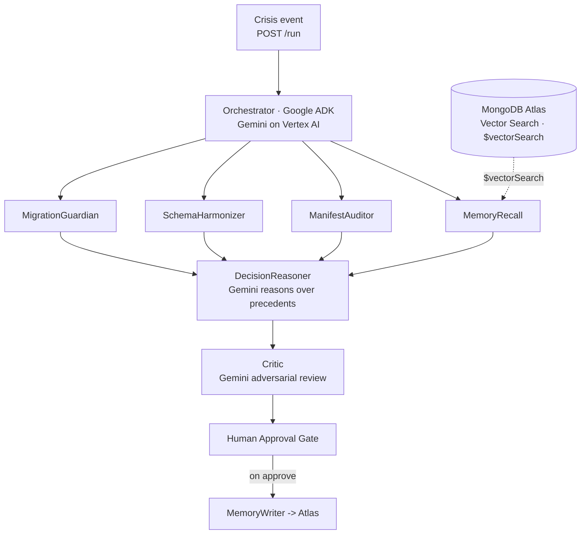

<!--
  CargoDB — Devpost "Project details" / "About the project"
  Paste the body below into Devpost. Upload the 4 PNGs in this folder to Project Media.
  Devpost does NOT render Mermaid — for the Devpost paste, drop the ```mermaid block
  (the uploaded PNGs cover it). On GitHub, both the PNGs and the Mermaid render.
-->

> **CargoDB is demonstrated on maritime logistics, but it works for any domain that needs semantic agent memory** — support tickets ("have we resolved this before?"), fraud cases, clinical notes, incident response.

## Inspiration

AI agents are brilliant and amnesiac. Every run starts from zero. The agent that handled a near-identical situation last month has no recollection of it today, so it re-derives — or re-mistakes — the same call from scratch. There's no institutional memory, no "we tried that and it backfired," no precedent.

Keyword search doesn't fix it: two decisions can be the *same* decision in different words — "hold the shipment" vs. "delay departure pending review" — and an exact-match index will never connect them. What agents need is **semantic recall over their own decision history** — retrieval by meaning, not by string. That's CargoDB.


## What it does

CargoDB is persistent, semantic memory for AI agents, built on **MongoDB Atlas Vector Search**. It stores every decision an agent makes as a vector, and when the next hard call comes in it answers the only question that matters: *"Have we seen this before — and what did we do?"*

Two capabilities, kept deliberately separate:

- **Recall is pure Atlas Vector Search.** The query is embedded with **Voyage AI** (`voyage-3.5-lite`, 1024-dim), and `$vectorSearch` against the `decisions_vector_idx` index (cosine) returns the nearest past decisions with a similarity score. No LLM in the retrieval path — recall is a millisecond query, not a guess.
- **Reasoning is Gemini.** A `DecisionReasoner` takes the recalled precedents and *chooses the action*, citing which precedent drove it and why, with visible chain-of-thought. A Gemini `Critic` then adversarially challenges that decision. Nothing is written back to Atlas until a human approves.

And the memory isn't static fixtures — CargoDB builds it from **live AIS vessel telemetry**, tracking real ships in the Hormuz corridor and writing each conflict to Atlas, so recall runs against real history.

## How we built it

Seven specialists on **Google ADK**, on **Cloud Run**, with **Gemini on Vertex AI** as the reasoner.

**System architecture:**


**The pipeline** — `MemoryRecall → ManifestAuditor → SchemaHarmonizer → MigrationGuardian → DecisionReasoner (Gemini) → Critic (Gemini) → MemoryWriter`:




**Recall is vector search; Gemini reasons over the precedents to decide:**


CargoDB talks to Atlas through the official **`mongodb-mcp-server` over stdio** — `aggregate` (carries the `$vectorSearch` pipeline), `insert-many`, `find`, `create-index`, `explain`, `atlas-get-performance-advisor`, and more — the same MCP tooling an agent uses in production. Embeddings are Voyage AI (`voyage-3.5-lite`, 1024-dim cosine on `decisions_vector_idx`).

**Stack:** Python · Google ADK · Gemini 2.5 Flash (Vertex AI) · MongoDB Atlas Vector Search · `mongodb-mcp-server` (MCP) · Voyage AI embeddings · FastAPI · Next.js + Tailwind · AISstream (live telemetry) · Cloud Run · Secret Manager · Docker.

## Challenges we ran into

- **Keeping recall and reasoning separate.** It's tempting to let the LLM "remember" — but recall must be deterministic and fast, so retrieval is *pure* `$vectorSearch` and Gemini only enters as the reasoner over the results. The `DecisionReasoner` chooses the action with a rationale, and falls back to deterministic top-match selection if Gemini is unavailable, so the pipeline never breaks.
- **MongoDB MCP + vector search is preview.** The `$vectorSearch` path through the MCP server needs the `MDB_MCP_PREVIEW_FEATURES=search` flag — without it the server starts fine but silently lacks vector search. We also build the `decisions_vector_idx` index (1024-dim cosine, with `decision_type`/`timestamp` filters) idempotently on startup.
- **Live AIS ingestion.** Subscribing to the AISstream WebSocket for the Hormuz bounding box, embedding each vessel position/static event with Voyage AI, and writing it to Atlas — so recall runs against real vessel history, not just seeds.
- **Prompt-injection over recalled memory.** Recalled decision text is attacker-reachable, so it's treated as **data, never instructions**; the Critic scans for injection and forces rejection on detection.
- **Atlas egress from Cloud Run.** Allowlisting the Cloud Run egress IP so the agent can reach the Atlas cluster.

## Accomplishments that we're proud of

- **Real semantic recall** — "have we seen this before?" answered as a millisecond `$vectorSearch`, not an LLM guess.
- **Gemini as the brain of the decision**, reasoning over the recalled precedents with a transparent rationale — and a safe code fallback.
- Memory built from **live AIS vessel telemetry**, not static fixtures.
- An adversarial Critic and a mandatory human gate — the memory only grows on approved decisions.

## What we learned

- **Recall and reasoning are different jobs.** Vector search for retrieval; an LLM for judgment. Conflating them makes both worse.
- Voyage AI embeddings + Atlas `$vectorSearch` is a clean, fast primitive for agent memory.
- MCP-over-stdio patterns for MongoDB — and the silent preview-flag trap.
- A memory that grows with human-approved decisions compounds: every crisis makes the next one easier.

## What's next for CargoDB

- Shared fleet memory — every ShipSafe agent reads and writes the same Atlas memory.
- Memory decay / TTL and recency weighting so stale precedents fade.
- Multi-vector recall (decision + outcome + context) for sharper matches.
- Drop-in adapters for non-maritime domains (support, fraud, clinical).

---

**Built with** (Devpost tag field): `python · google-adk · gemini · vertex-ai · mongodb-atlas · vector-search · model-context-protocol · voyage-ai · fastapi · next.js · tailwindcss · aisstream · google-cloud-run · secret-manager · docker`

**Try it out:**
- Live dashboard — https://cargodb-dashboard-336382452417.us-central1.run.app
- GitHub — https://github.com/shipsafe-ai/shipsafe-cargodb
- One command — `npx shipsafe-cargodb demo`
